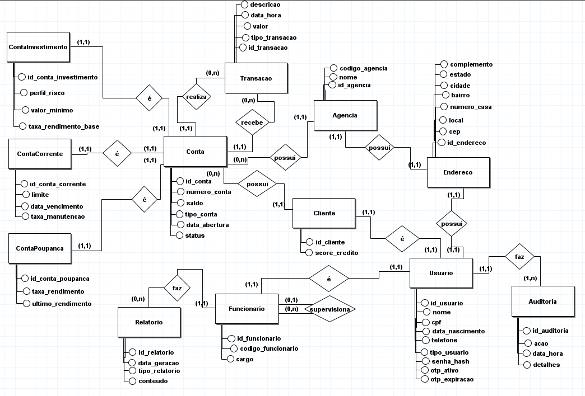
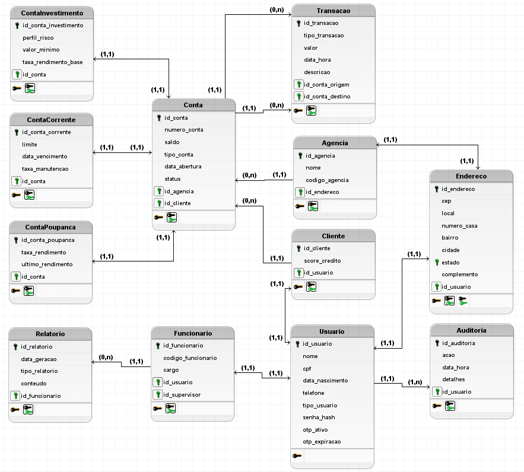
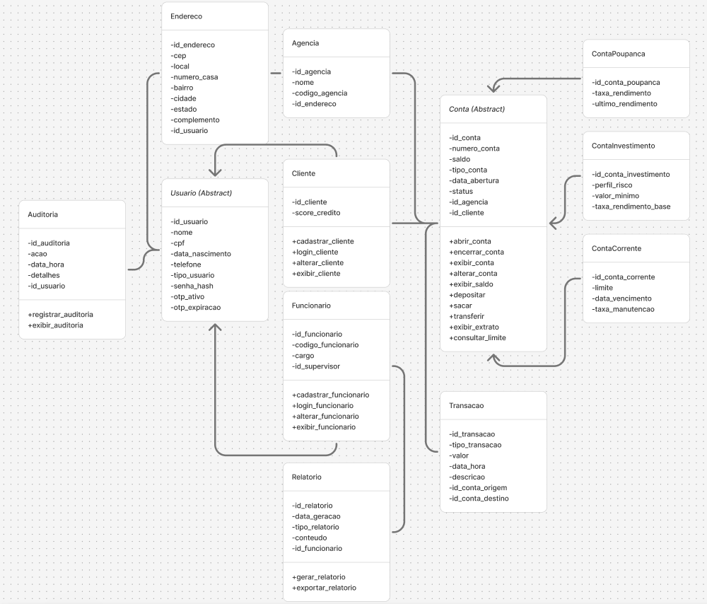

# Banco Malvader

Projeto de aplicação bancária desenvolvido para a disciplina de **Programação Laboratorial de Banco de Dados**. Esse plano possui interface gráfica e persistência em banco de dados MySQL, assim como a gerência de contas bancárias com foco em Programação Orientada a Objetos (POO).

---

## Objetivo

Desenvolver uma aplicação bancária a qual é capaz de gerenciar contas, funcionários e clientes, com funcionalidades avançadas de gerenciamento bancário. Apresentando: 
- Interface gráfica intuitiva; 
- Segurança avançada com autentificação;
- Operações financeiras;
- Geração de relatórios financeiros detalhados;  
- Uso de banco de dados relacional MySQL com gatilhos, procedimentos armazenados, visões e auditoria.

---

## Tecnologias Utilizadas

- **Linguagem**: Java e SQL
- **Interface Gráfica**: JavaFX
- **Banco de Dados**: MySQL
- **Arquitetura**: MVC (Model-View-Controller)
- **Conexão DB**: JDBC
- **Criptografia**: MD5
- **OTP**: Geração dinâmica no banco para autenticação

---

## Estrutura do Projeto

```
banco_malvader/
├── src/
│   ├── main/
│   │   ├── java/
│   │   │   └── com/
│   │   │       └── package/  
│   │   │           ├── controller/
│   │   │           │   ├── 
│   │   │           │   └── 
│   │   │           │
│   │   │           ├── dao/
│   │   │           │   ├── 
│   │   │           │   ├── impl/ 
│   │   │           │   │   └── 
│   │   │           │   └── 
│   │   │           │
│   │   │           ├── model/
│   │   │           │   ├── 
│   │   │           │   └── 
│   │   │           │
│   │   │           ├── util/
│   │   │           │   ├── 
│   │   │           │   ├── 
│   │   │           │   └── 
│   │   │           │
│   │   │           └── view/
│   │   │               ├── 
│   │   │               ├── componentes/ 
│   │   │               │   └── 
│   │   │               └── 
│   │   │
│   │   └── resources/
│   │       ├── 
│   │       ├── 
│   │       └── 
│
├── lib/ 
│   ├── 
│   └── 
│
├── 
├── 
└── README.md 
```

---

## Funcionalidades Principais

### Autenticação
- Login seguro com senha e OTP (One-Time Password)
- Registro de tentativas e auditoria
- Bloqueio após 3 tentativas mal-sucedidas

### Menu Funcionário
- Abertura, alteração e encerramento de contas (CP, CC, CI)
- Cadastro de funcionários com controle hierárquico
- Consulta de clientes, contas e funcionários via views
- Geração de relatórios com filtros avançados e exportação
- Auditoria e validação de dados com gatilhos e procedures

### Menu Cliente
- Consulta de saldo e extrato
- Depósitos, saques e transferências
- Validação de limites, taxas e projeções de rendimento
- Logout com registro em auditoria

---

## Banco de Dados

- **Tabelas**: Usuario, Funcionario, Cliente, Endereco, Agencia, Conta, Conta_Poupanca, Conta_Corrente, Conta_Investimento, Transacao, Auditoria, Relatorio, Conta_Encerramento_Historico.
- **Triggers**: Atualizar_Saldo, Validar_Senha, Limite_Deposito_Cliente, Auditar_Abertura_Conta, Verificar_Limite_Funcionarios_Agencia, Aplicar_Taxa_Saque_Excessivo.
- **Procedures**: Gerar_OTP, Calcular_Score_Credito, Calcular_Metricas_Cliente, Encerrar_Conta_Cliente, Atualizar_Senha_Usuario, Alterar_Telefone_Usuario, Registrar_Tentativa_Login, Registrar_Logout_Usuario.
- **Visões**: VW_Resumo_Contas, VW_Movimentacoes_Recentes, VW_Detalhes_Conta, VW_Detalhes_Funcionario, VW_Detalhes_Cliente, VW_Relatorio_Movimentacoes_Detalhadas, VW_Relatorio_Inadimplencia, VW_Relatorio_Desempenho_Funcionarios.

### Modelagem Conceitual



### Modelagem Lógica



### Diagrama de Classes



---

## Relatórios

- Movimentações financeiras por período
- Clientes inadimplentes
- Desempenho por funcionário
- Exportação para PDF e Excel
- Dados baseados em views otimizadas

---

## Requisitos de Aceitação

- Todas as funcionalidades implementadas e testadas
- Interface gráfica funcional e responsiva
- Banco de dados com procedures, gatilhos e views operacionais
- Relatórios exportáveis
- Documentação completa com diagrama ER e instruções

---

## Documentação Entregue

- Diagrama ER
- Manual de instalação e execução
- Requisitos (funcionais e não funcionais)
- Códigos comentados e organizados
- Apresentação com demonstração funcional

---

## Licença

Este projeto está licenciado sob a licença MIT - veja o arquivo LICENSE para detalhes.

## Equipe

- Alice Ferreira (UC24100375)
- Ana Clara Ferreira (UC24101888)
- Bárbara Dantas (UC24101492)
- Professor Orientador: William Roberto Malvezzi
- Universidade Católica de Brasília    
